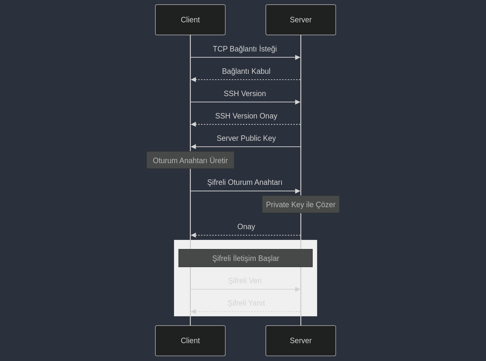

# SSH (Secure Shell)

SSH, güvenli uzaktan bağlantı ve dosya transferi sağlayan bir protokoldür. Bu bölümde SSH'ın temel kullanımını ve güvenlik yapılandırmasını öğreneceksiniz.

## 📚 İçerik

1. [SSH Nedir?](#ssh-nedir)
2. [SSH Bağlantısı](#ssh-bağlantısı)
3. [SSH Key Yönetimi](#ssh-key-yönetimi)
4. [Authorized Keys](#authorized-keys)
5. [SCP ile Dosya Transferi](#scp-ile-dosya-transferi)
6. [SSH Yapılandırması](#ssh-yapılandırması)

## SSH Nedir?


 SSH (Secure Shell), ağ üzerinden güvenli iletişim sağlayan bir protokoldür. Başlıca özellikleri:

- Şifrelenmiş bağlantı
- Güvenli kimlik doğrulama
- Dosya transferi imkanı
- Port yönlendirme
- X11 forwarding desteği


## SSH Bağlantısı

### Temel Bağlantı Sözdizimi

```bash
ssh kullanici@sunucu
```

### Örnekler

```bash
# Standart port (22) ile bağlantı
ssh user@192.168.1.100

# Farklı port ile bağlantı
ssh -p 2222 user@192.168.1.100

# Özel bir SSH anahtarı kullanarak
ssh -i ~/.ssh/ozel_anahtar user@192.168.1.100
```

## SSH Key Yönetimi

### SSH Anahtar Çifti Oluşturma

```bash
# RSA anahtar çifti oluşturma
ssh-keygen -t rsa -b 4096

# Ed25519 anahtar çifti oluşturma (önerilen)
ssh-keygen -t ed25519

# Özel isimle anahtar oluşturma
ssh-keygen -t ed25519 -f ~/.ssh/proje_anahtari
```

### Anahtar Özellikleri

- `id_rsa`: Özel anahtar
- `id_rsa.pub`: Açık anahtar
- Varsayılan konum: `~/.ssh/`
- İzinler: 
  - Özel anahtar: 600 (rw-------)
  - Açık anahtar: 644 (rw-r--r--)

## Authorized Keys

### Yapılandırma

1. Açık anahtarı uzak sunucuya kopyalama:
```bash
ssh-copy-id user@remote-server
```

2. Manuel yapılandırma:
```bash
# Uzak sunucuda
mkdir -p ~/.ssh
chmod 700 ~/.ssh
touch ~/.ssh/authorized_keys
chmod 600 ~/.ssh/authorized_keys

# Açık anahtarı authorized_keys dosyasına ekleme
echo "ssh-rsa AAAAB3NzaC1..." >> ~/.ssh/authorized_keys
```

## SCP ile Dosya Transferi

### Temel Kullanım

```bash
# Yerel -> Uzak
scp dosya.txt user@remote:/hedef/dizin/

# Uzak -> Yerel
scp user@remote:/uzak/dosya.txt ./

# Dizin kopyalama
scp -r dizin/ user@remote:/hedef/

# Özel port kullanma
scp -P 2222 dosya.txt user@remote:/hedef/
```

### Örnekler

```bash
# Birden fazla dosya kopyalama
scp dosya1.txt dosya2.txt user@remote:/hedef/

# Joker karakter kullanımı
scp *.txt user@remote:/hedef/

# Farklı sunucular arası kopyalama
scp user1@sunucu1:/kaynak/dosya user2@sunucu2:/hedef/
```

## SSH Yapılandırması

### İstemci Yapılandırması (~/.ssh/config)

```
# Varsayılan ayarlar
Host *
    ServerAliveInterval 60
    ServerAliveCountMax 3

# Özel sunucu ayarları
Host sunucu1
    HostName 192.168.1.100
    User kullanici
    Port 2222
    IdentityFile ~/.ssh/ozel_anahtar

# Atlama sunucusu kullanımı
Host hedef
    HostName 10.0.0.100
    User kullanici
    ProxyJump atlama-sunucusu
```

### Sunucu Yapılandırması (/etc/ssh/sshd_config)

```
# Güvenlik ayarları
PermitRootLogin no
PasswordAuthentication no
PubkeyAuthentication yes
PermitEmptyPasswords no

# Port ayarı
Port 22

# Protokol seçimi
Protocol 2

# Oturum ayarları
ClientAliveInterval 300
ClientAliveCountMax 2
```

## Güvenlik İpuçları

1. **Anahtar Güvenliği**
   - Güçlü parolalar kullanın
   - Özel anahtarları güvenli saklayın
   - Düzenli yedekleme yapın

2. **Sunucu Güvenliği**
   - Root girişini devre dışı bırakın
   - Parola ile girişi kapatın
   - Güvenlik duvarı kullanın
   - Başarısız girişleri izleyin

3. **Bağlantı Güvenliği**
   - Güvenilmeyen ağlarda dikkatli olun
   - Bağlantı şifrelemesini kontrol edin
   - Port yönlendirmelerini sınırlayın

## Yaygın Sorunlar ve Çözümleri

1. **Bağlantı Reddi**
   - İzinleri kontrol edin
   - Sunucu durumunu kontrol edin
   - Güvenlik duvarı ayarlarını kontrol edin

2. **Anahtar Sorunları**
   - Anahtar izinlerini düzeltin
   - Known hosts dosyasını güncelleyin
   - Anahtar formatını kontrol edin

3. **Performans Sorunları**
   - Ağ bağlantısını test edin
   - Sunucu yükünü kontrol edin
   - Compression ayarını kullanın

------   
<br>
<br>
<br>
<div align="center">

[🏠AnaSayfa](../README.md) &nbsp;&nbsp;&nbsp;  • &nbsp;&nbsp;&nbsp;  [📑Bölüm](README.md)

</div>